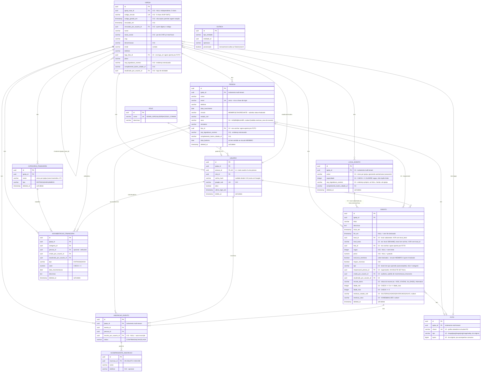

# Domus — Roadmap da Versão de Produção

> Planejamento para evoluir o Domus do escopo acadêmico (TCC) para uma versão de
> produção, começando pelo piloto na igreja do autor e preparando o terreno para o
> lançamento comercial. Escrito para servir de **contexto e guia ao trabalhar com o
> Claude Code**. 

## Modo de trabalho: mentoria (instrução para o Claude Code)

O autor está aprendendo engenharia de software e **não quer só ver código pronto** — quer
entender tudo. Em cada decisão e cada implementação, aja como um **mentor/professor**, não
apenas como executor:

- **Antes de escrever código,** explique o plano: o que vai ser feito, por quê, quais
  conceitos estão envolvidos, quais bibliotecas/APIs serão usadas e o **motivo** da escolha
  (e quais alternativas foram descartadas, e por quê).
- **Explique o fluxo de ponta a ponta:** como a requisição entra, passa pelas camadas
  (controller → service → repository) e volta; o que cada parte faz.
- **Explique a lógica e as libs, não só o resultado.** Quando surgir um conceito novo,
  ensine como um professor ensinaria a um aluno, usando **analogias** quando ajudar.
- **Vá um passo por vez** e confirme o entendimento antes de seguir. Prefira ensinar bem a
  entregar rápido.
- Objetivo final: o autor precisa **entender o suficiente para manter e evoluir sozinho**
  cada coisa construída. Trate como pareamento (pair programming), não como entrega.

---

## Como usar este documento

- Isto é um **roadmap**, não uma especificação técnica detalhada. O fluxo completo de
  cada feature será desenhado com o Claude Code na hora de implementar.
- Trabalhe **uma feature por vez**, na ordem das fases. Cada fase tem um objetivo e um
  critério de "pronto".
- Sugestão prática: mantenha um `CLAUDE.md` na raiz do repositório com o contexto fixo
  do projeto (stack, convenções, arquitetura) e aponte o Claude Code para **este**
  roadmap quando for planejar cada item. Assim ele não precisa reler tudo toda vez.
- A seção **Decisões já tomadas** (no final) são *guardrails*: já foram debatidas e não
  precisam ser rediscutidas a cada feature.

---

## Contexto do projeto

Domus é um SaaS **multi-inquilino (multi-tenant)** de gestão administrativa de igrejas
de pequeno e médio porte. Módulos atuais (herdados do TCC): autenticação + recuperação
de senha, usuários, pessoas, eventos, financeiro (com categorias e relatórios) e busca
global unificada.

**Stack — Back:** Java 21, Spring Boot, Spring Security, PostgreSQL (fonte da verdade),
Spring Data JPA, Flyway (migrations), Redis (cache), Elasticsearch (busca, sincronizada
via *transactional outbox*).

**Stack — Front:** Next.js, TypeScript, CSS Modules, TanStack Query, React Hook Form + Zod.

**Convenções e padrões vigentes:**
- **Não commitar antes de o autor testar.** Entregue a correção, avise, e **espere**. Só
  commitar depois do teste — e num commit só, coerente, em vez de vários commits parciais
  da mesma coisa. Exceção: algo que valha por si (ex.: uma correção isolada que não depende
  do resto). Isso vale para **toda a aplicação**, não só para a feature da vez.
- **Nunca imprimir segredo.** Não despejar `.env`, chave, token ou senha na conversa — nem via
  `cat`, nem por script que gere `export` no stdout. Segredo impresso não se apaga: fica no
  histórico e só sai por rotação, que custa ao autor. Para carregar variáveis, redirecione para
  arquivo e faça `source`. Para conferir um valor, mostre só a forma, mascarada.
  *(Aconteceu em 2026-07-22: o `.env` inteiro foi impresso e as credenciais do R2 — que eram as
  mesmas do backup — tiveram de ser rotacionadas.)*
- **Esconder no front não é esconder.** Dado que um perfil não pode ver não pode sair da API:
  se o JSON traz o campo, basta abrir o DevTools. Restrição por perfil se faz no **backend**
  (DTO reduzido ou endpoint próprio); a tela só reflete o que já foi omitido.

**Design: programar para interface (SOLID na prática, não como ritual)**

O objetivo é um só: **mudança localizada**. Se alterar uma decisão exige editar N arquivos, o
desenho está errado — não porque violou uma sigla, mas porque N vai crescer.

- **Pergunte pela CAPACIDADE, não pela IDENTIDADE.** `podeGerenciarInscricoes(role)` em vez de
  `role === 'ADMIN_IGREJA' || role === 'LIDER'`. A segunda forma espalha a regra por toda parte
  e transforma renomear um perfil numa caçada. Toda checagem de permissão passa por uma função
  nomeada pela ação; o nome do perfil aparece **em um arquivo só**, de cada lado.
- **Nada de literal de domínio solto.** Perfis, status, vínculos e códigos de erro vivem em
  `enum` (back) e união de tipos (front). String crua no meio do código é erro de digitação
  esperando acontecer, e o compilador não ajuda.
- **Dependa de abstração onde há troca prevista.** `EmailService` com implementação `Log` e
  `Resend` é o exemplo bom que já existe: trocar de provedor não toca em quem envia e-mail.
  Onde a troca **não** é prevista, interface é cerimônia — não crie por reflexo.
- **Uma razão para mudar.** Quando um arquivo passa a mudar por motivos diferentes (regra de
  negócio *e* formatação *e* permissão), separe. Vale para service, componente e CSS.
- **Estenda sem editar.** Adicionar um perfil, um status ou um provedor não deveria exigir
  `if/else` novo em vários lugares — deveria ser mais uma entrada num mapa ou enum.

Regra prática antes de escrever: **"se isto mudar de nome ou de valor amanhã, quantos arquivos
eu abro?"** Se a resposta for mais que um ou dois, o desenho ainda não está pronto.
- Isolamento lógico por `igreja_id` em toda entidade do domínio, **sempre extraído do
  JWT, nunca do corpo da requisição** (defesa contra acesso cruzado entre igrejas).
- Camadas `controller → service → repository`; services retornam **DTOs**, nunca
  entidades de persistência.
- **Soft delete** (`deleted_at`) nas entidades.
- Perfis de acesso: `ADMIN_IGREJA`, `LIDER`, `ACESSO_COMUM`.
- Relação central: todo **usuário** (credencial de acesso) está vinculado a exatamente
  uma **pessoa**. Nem toda pessoa tem usuário. `pessoa.email` é **único**. `MEMBRO` é um
  **vínculo** (batizado), não o cadastro — o cadastro é `pessoa`.
- **Responsividade é obrigatória em toda feature de front.** Toda funcionalidade nova
  (tela, formulário, modal, drawer, tabela) tem que ser ajustada para **mobile** como
  parte da própria entrega — não é etapa separada nem opcional. Padrões já usados:
  tabelas viram **cards** no mobile; headers com título+botão **empilham**; grids de
  formulário **colapsam** para 1 coluna; modais/drawers reduzem padding; `min-width: 0`
  na cadeia flex/grid e larguras fixas (ex.: botão Google) revistas para evitar overflow
  horizontal. Validar no viewport de celular antes de considerar pronto.

---

## Modelo de dados (diagrama ER)

> **Fonte da verdade são as migrations** (`src/main/resources/db/migration`), não este
> diagrama. Ao mexer no schema, atualize aqui também. Estado atual: **V3**.
> `V1__schema_inicial.sql` consolida as antigas V1–V16 em 2026-07-21 (ver nota logo
> abaixo do diagrama). Campos de rotina (`created_at`, `updated_at`, `deleted_at`) foram
> omitidos por ruído, exceto quando têm significado (soft delete).

### O que ler neste diagrama

- **`igreja_id` em toda entidade de domínio** é o isolamento multi-tenant. Vem sempre do
  JWT, nunca do corpo da requisição.
- **A auto-relação de `IGREJA`** (`igreja_mae_id`) é a hierarquia sede↔congregações. Uma
  congregação **é** uma igreja que tem mãe — por isso as checagens de isolamento
  continuam valendo sem alteração. **Regra dos 2 níveis:** quem tem mãe não pode ser mãe.
- **`PESSOA ||--o| USUARIO`** é 1-para-1 opcional: todo usuário está vinculado a uma
  pessoa; nem toda pessoa tem usuário (só quem recebeu acesso). O cadastro é `pessoa` —
  `MEMBRO` é um **vínculo** dela, não o registro em si (dá pra ter login sem ser batizado).
- **`pessoa.vinculo`** (`MEMBRO`|`CONGREGANTE`) substitui o antigo `status` +
  `batizado`: `MEMBRO` é quem foi batizado e formalmente membro; `CONGREGANTE` é quem
  frequenta sem ser batizado (absorve o antigo `VISITANTE`). Não existe "inativo" — quem
  parou de frequentar é **arquivado** (`deleted_at`), o mecanismo que já existia.
  `data_batismo` só faz sentido quando `vinculo = MEMBRO`.
- **`igreja` referencia `usuario` e vice-versa.** As FKs circulares são intencionais e
  seguras porque as de `igreja → usuario` são todas nuláveis (auditoria).
- **Inscrição em evento:** uma inscrição pertence a uma pessoa e a um evento.
  Vagas contam **pessoas** (inscritos confirmados + seus acompanhantes), não inscrições.
  Acompanhantes (`acompanhante_inscricao`) existem apenas para quem NÃO tem vínculo com a
  igreja e servem para saber "de onde essa pessoa veio". Cancelamento é mudança de status
  (preserva histórico de quem inscreveu quem); reinscricão reaproveita a mesma linha
  graças ao `UNIQUE (evento_id, pessoa_id)`. O `requer_inscricao` é o master toggle
  que separa evento que se organiza de evento que só acontece.

- **Cadastro de evento enriquecido (V3):** `local_texto` é o antigo `local` (RENAME, não
  ADD, para preservar dado); `local_id` aponta para `LOCAL_EVENTO`, um local cadastrado
  com endereço próprio ou, se `NULL`, o endereço é herdado do da própria igreja. O CHECK
  `local_id IS NULL OR local_texto IS NULL` impede os dois ao mesmo tempo — um evento é ou
  num local cadastrado, ou num texto livre ad-hoc, nunca ambos. `LOCAL_EVENTO.capacidade`
  **sugere** o número de vagas do evento; não é limite imposto pelo banco nem pela regra de
  negócio (fica pro backlog). `tipo` é texto livre com autocomplete que aprende com o uso —
  deliberadamente não chamado de "categoria" (nome já ocupado por `categoria_financeira`).
  `responsavel_pessoa_id`, `criado_por_usuario_id` e `atualizado_por_usuario_id` reusam o
  padrão de auditoria de `movimentacao_financeira`. `recorte_etario` + `idade_min`/
  `idade_max` + `restricao_estado_civil` + `restricao_sexo` são a elegibilidade de
  inscrição: quatro regras independentes, avaliadas no momento de inscrever — não somam
  automaticamente, cada uma bloqueia por conta própria quando o dado da pessoa falta
  (idade sem `data_nascimento`, sexo sem `pessoa.sexo`).
- **`FOTO`** (V2) é metadado apenas — os bytes vivem num bucket **privado** do Cloudflare
  R2, servido pela própria API (`GET /fotos/{id}`), nunca por URL pública. `pessoa.foto`,
  `evento.foto` e `igreja.logo_url` deixaram de ser `varchar` de URL e viraram
  `foto_id`/`logo_foto_id` (`uuid`, `ON DELETE RESTRICT`): o job de limpeza decide o que
  apagar por **ausência** de referência, e a FK faz o banco recusar apagar uma foto ainda
  referenciada — a proteção não depende de a consulta da limpeza estar certa.

> **Consolidação das migrations (2026-07-21):** `V1__schema_inicial.sql` substitui as
> antigas V1–V16 num único arquivo — não havia dado real em produção, então as duas
> bases (dev e produção) foram recriadas do zero. **Backups tirados antes dessa data não
> restauram contra o código atual** (o schema não bate mais: `membro` virou `pessoa`,
> `status`/`batizado` viraram `vinculo`, etc.).

---

## Princípios norteadores

1. **Igreja = design partner, não primeiro cliente comercial.** É um *soft opening*:
   onboarding na mão, sem self-service nem cobrança. O objetivo é observar uso real e
   aprender antes de escalar.
2. **MVP é mínimo *viável*.** Entregar a menor coisa que gera valor real e destrava
   aprendizado. Toda feature construída antes do uso real é construída no escuro.
3. **Construir o mínimo, depois observar.** Adicionar campos e filtros com base em uso
   real, não em suposição (YAGNI).
4. **Build vs. buy.** Não reinventar o que provedores maduros já fazem (pagamento,
   e-mail, SMS). Integrar, não construir do zero.
5. **Fundações e segurança antes de dado real.** Backup, e-mail, rastreamento de erro,
   modelo de autenticação e correções de segurança precisam existir **antes** de a igreja
   entrar de verdade.

---

## Fases

### Fase 1 — Fundações, autenticação e endurecimento de produção

> **Objetivo:** deixar o ambiente seguro, observável e com o **modelo de autenticação
> definido**, antes de qualquer dado real de igreja entrar. Quase nada aqui é "feature
> visível", mas tudo é pré-requisito — inclusive a auth, que é a única porta de entrada
> do sistema.

> **Progresso (atualizado em 2026-07-15):** ver detalhes na memória do projeto
> (`refresh-token-familia-auth`, `email-transacional-reset-senha`). Tudo em branch `producao`.

- [x] **Modelo de autenticação: híbrido (Google OAuth + e-mail/senha nativo)** — **FEITO**:
  nativo + reset de senha ✅ e Google OAuth (login + cadastro) ✅.
- Decisão: duas formas de entrar, que convivem — "Entrar com Google" (OAuth) e
  e-mail/senha nativo (que JÁ existe e funciona, com proteções tipo bcrypt).
- [x] Falta no nativo: função "esqueci minha senha" (reset via link por e-mail) — **FEITO**
  (endpoints `/auth/forgot-password` e `/auth/reset-password` + telas no front).
- [x] Login E cadastro com Google (OAuth) — **FEITO** (endpoints `/auth/google/login` e
  `/auth/google/registrar`; ID token validado com `GoogleIdTokenVerifier`; `senha_hash`
  nullable + `google_sub` único; login nativo barra conta só-Google com `CONTA_SEM_SENHA`;
  botões no front de login e cadastro). Ver spec/plano em `docs/superpowers/`.
- Entra de novo: login E cadastro com Google. No cadastro, o Google cria igreja +
  primeiro membro + primeiro usuário (ADMIN_IGREJA) já com e-mail e nome verificados.
  *(Texto histórico da Fase 1: à época a tabela chamava-se `membro`; hoje é `pessoa`.)*
- Provisionamento (admin dá acesso) ≠ login. Depois de provisionado, o membro entra por:
  (a) Google — vínculo pelo e-mail (membro.email é único), primeiro login verifica posse;
  (b) Nativo — precisa definir uma senha antes, reusando o MESMO fluxo do reset.
- Sessão: nos dois caminhos, após identificar a pessoa (token Google ou bcrypt), o
  backend emite os próprios JWT + refresh. Logo, refresh/revogação e rate limiting valem
  para ambos.

- [x] **E-mail transacional** (Resend) — **FEITO e validado** (envio real confirmado).
    - *Back:* `EmailService` (interface) + `LogEmailService`/`ResendEmailService` chaveados
      por `email.provider`. Falta: verificar domínio no Resend (hoje só envia p/ o dono da
      conta no sandbox).
    - *Front:* estado "e-mail enviado" na tela `/forgot-password` ✅.

- [x] **Backup automático do Postgres** — **FEITO e validado ao vivo** (2026-07-17):
    - *Motivação real:* o **Neon Free dá só 6h de PITR**. O dump externo não é a segunda
      rede de segurança — é a **única**. E backup que mora no mesmo provedor que o dado é
      redundância, não backup.
    - *Como:* workflow diário (`0 6 * * *` UTC = 03:00 BRT) → `pg_dump -Fc` → **teste de
      restauração** num Postgres 16 descartável comparando a contagem de **cada tabela**
      contra a origem → criptografia **`age` assimétrica** (só a chave pública no CI: ele
      escreve e não lê) → **Cloudflare R2** (`domus-backups`, retenção de 90 dias via
      lifecycle rule). Lógica em `scripts/backup-postgres.sh` — roda local, porque workflow
      só se testa empurrando commit.
    - *Alerta:* **Sentry Crons** como dead man's switch + issue alert `Backup do Postgres
      falhou`. **A regra padrão do projeto NÃO servia** (filtra "high priority" e o issue de
      cron não entra) — descoberto quebrando de propósito. O alerta precisa dos **dois**
      gatilhos: `new issue` **e** `resolved becomes unresolved` — o issue auto-resolve
      quando o backup volta, então as falhas seguintes são **reaberturas**, e só o primeiro
      gatilho avisaria uma única vez na vida.
    - *Validado provocando as falhas:* dump truncado → o teste reprova; secret quebrado →
      job falha, check-in `error`, issue, **e-mail confirmado na caixa**. E o ensaio manual
      completo: baixar do R2, descriptografar com a chave privada, restaurar, conferir.
    - ⚠️ **A chave privada `age` é ponto único de falha** (Bitwarden + cópia offline).
    - ⚠️ **Ensaio manual trimestral** (`scripts/ensaio-restauracao.sh`) no calendário — a
      automação **não** prova que o arquivo abre com a sua chave; o CI não tem a privada.
    - Ver spec/plano em `docs/superpowers/`.

- [x] **Rastreamento de erro (Sentry) + logs estruturados** — **FEITO** (2026-07-16):
    - *Back:* `sentry-spring-boot-starter-jakarta` (DSN por env, só captura 500, scrub de PII);
      logs estruturados (`logback-spring.xml`: JSON em prod / console+MDC em dev) com
      `RequestIdFilter` (`request_id` + header `X-Request-Id`) e `usuario_id`/`igreja_id` no MDC.
    - *Front:* `@sentry/nextjs` (instrumentation client+server, DSN por env, scrub); CSP libera `*.sentry.io`.
    - *Falta ligar:* criar conta no sentry.io e plugar `SENTRY_DSN` (back) e `NEXT_PUBLIC_SENTRY_DSN` (front).

- **Correções de segurança (as "nuances")**
    - [x] **Refresh token + revogação:** **FEITO** — refresh opaco no Redis, rotação,
      revogação por logout e **detecção de reuso** (famílias de token). Access token 10 min.
      Bônus: corrigido o bug do contador de tentativas de login (nunca bloqueava) e o
      backend agora devolve **401** (não 403) p/ token ausente/expirado (destrava o refresh no front).
    - [x] **Rate limiting em todos os endpoints** (não só no login) — **FEITO** (2026-07-16):
      `RateLimitFilter` (janela fixa no Redis, global 100/min + auth 10/min por IP, 429 +
      `Retry-After`, `X-Forwarded-For` sob flag) e `LoginAttemptService` migrado p/ Redis.
      Limites por env (`app.ratelimit.*`). Validado ao vivo (curl → 429).
    - [x] **Segredos em variáveis de ambiente** — já em uso (`.env`, gitignored).
    - [x] **CORS restrito + security headers** — **FEITO** (commit `f607b0f`): CORS por env
      (`app.cors.allowed-origins`) e security headers no back (HSTS, X-Frame-Options, nosniff,
      Referrer-Policy, CSP) e no front (`next.config.ts`).
    - [x] **Token fora do `localStorage` (XSS) + CSRF reativado** — **FEITO e validado ao vivo**
      (2026-07-16): a sessão vive em cookies `httpOnly`+`Secure`+`SameSite=Lax` emitidos pelo
      backend (`domus_access` 10 min `Path=/api`; `domus_refresh` 7 dias `Path=/api/auth`).
      Saíram o `persist` do zustand, o `localStorage.setItem` e o `document.cookie` por JS —
      **o localStorage não participa mais da autenticação** (nem o `id`). **CSRF double-submit
      reativado** junto, como o modelo de cookie exige. Entrou `GET /auth/me` (o servidor virou
      dono da verdade da sessão; de quebra mata a role velha em cache) e o front passou a falar
      com a API por um **proxy same-origin** (`/api/*` no Next), o que desacopla o cookie da
      decisão de hospedagem. Validado no navegador: `document.cookie` mostra só `XSRF-TOKEN`
      (legível por design) e `g_state` (do Google), sem os cookies de sessão.
      **⚠️ Requisito de deploy que isso criou:** precisa de um proxy reverso real na frente do
      Next (`X-Forwarded-For`/`Proto`) + `RATELIMIT_TRUST_FORWARDED_FOR=true` +
      `FORWARD_HEADERS_STRATEGY=framework`, senão o rate limiting por IP vira um balde único.
      Ver spec/plano em `docs/superpowers/` e os resíduos no BACKLOG.
    - [x] **Vulnerabilidades de dependência (front)** — **FEITO** (2026-07-16, commit `ae95bb8`):
      `npm audit` saiu de 7 (1 baixa, 3 médias, 3 altas) para **0**. Como: `npm audit fix` (sem
      `--force`, que rebaixaria o Next p/ 9.3.3 e quebraria o build), `next@16.2.10` explícito e
      `overrides.postcss ^8.5.15`. **Falta:** avaliar o back (ex.: OWASP dependency-check).
    - [ ] Revisão de **validação de input** em toda entrada — contínuo.
    - [x] **Verificar domínio no Resend** — **FEITO** (2026-07-18): domínio `domusigreja.com.br`
      verificado (DKIM + SPF/MX no subdomínio `send`, via DNS na Cloudflare). Remetente de
      produção `Domus <nao-responda@domusigreja.com.br>` (env `EMAIL_FROM`). Testado ao vivo:
      "esqueci minha senha" chegou na caixa, sem cair no spam.

- **Critério de pronto:** dá pra colocar dado real sem medo de perder, sem ficar cego a
  erros, com auth definida e sem os gaps de segurança conhecidos.

- ✅ **FASE 1 CONCLUÍDA (2026-07-18).** Produção no ar em `https://domusigreja.com.br`
  (Hetzner VPS + Cloudflare Tunnel + Neon Frankfurt). Ver detalhes de deploy e os
  "gotchas" na memória do projeto (`producao-no-ar-deploy`).

---

### Fase 2 — Funcionalidades de valor pra igreja

> **Objetivo:** o que faz a igreja realmente querer usar.

- [x] **Upload de foto** (pessoa, evento e logo da igreja) — **FEITO** (2026-07-22):
  tabela `foto` (V2) + bucket **privado** no Cloudflare R2, servido pela própria API
  (`GET /fotos/{id}?tamanho=thumb|display`, sessão e igreja validadas — nunca URL pública,
  porque são rostos de membros, inclusive crianças). Três versões (`original` guardado,
  nunca servido; `display` 1200px; `thumb` 200px). Validação por **conteúdo** (não
  extensão), limite de 50 megapixels checado no header antes de decodificar, e
  redecodificação que descarta EXIF (inclusive a coordenada de GPS do celular). Limpeza
  automática: órfã após 24h, foto de pessoa arquivada após 6 meses, troca remove a
  anterior na hora — ambas as janelas configuráveis (`app.fotos.orfa-horas`,
  `app.fotos.arquivada-meses`). `pessoa.foto`/`evento.foto`/`igreja.logo_url` viraram FK
  (`ON DELETE RESTRICT`) pra `foto.id`. Componente único `<UploadFoto>` no front, com
  recorte obrigatório em pessoa/logo (formato fixo) e opcional no banner de evento. Ver
  spec em `docs/superpowers/specs/2026-07-22-upload-foto-design.md`.
    - *Ficou de fora* (fora de escopo desta entrega): galeria (múltiplas fotos por
      entidade), vídeo, CDN de borda, e WebP como formato de **entrada** (ver BACKLOG).

- **Endereço estruturado** *(colunas, não tabela nova)*
    - *Decisão:* substituir `endereco VARCHAR(500)` por colunas na própria tabela `pessoa`:
      `cep`, `logradouro`, `numero`, `complemento`, `bairro`, `cidade`, `uf`. Isso
      **habilita filtro por bairro/cidade** sem JOIN extra.
    - *Back:* migration Flyway (nova estrutura + migração dos dados existentes), ajuste de
      DTOs.
    - *Front:* formulário com **auto-preenchimento via ViaCEP** (gratuito) ao digitar o CEP.

- [x] **Inscrição de pessoa em evento + preço e vagas** — **FEITO (2026-07-21):**
  inscrição dois níveis (self + inscrever outros), acompanhantes para quem não tem
  vínculo com a igreja, contagem de vagas com lock pessimista, `requer_inscricao` como
  toggle master, campo `vinculo` (`MEMBRO`|`CONGREGANTE`), lista reduzida para pessoas
  comuns (sem telefone de convidado) e completa para admins/líderes, preço apenas
  informativo (cobrança decidida na Fase 6).

- **Auditoria de evento (criado_por / atualizado_por)**
    - *Reutilizar o padrão que já existe em `movimentacao_financeira`* — barato e deixa o
      sistema consistente.
    - *Back:* colunas `criado_por_usuario_id` e `atualizado_por_usuario_id` no evento.
    - *Front:* exibir "criado por / atualizado por" na tela do evento.

- **Convite de acesso por e-mail (novo fluxo de provisionamento)**
    - *Motivação:* hoje o "conceder acesso" (`UsuarioService.concederAcesso`) exige que o
      **admin defina a senha** da pessoa e escolha a role de uma vez. Novo fluxo desejado:
      o admin **só escolhe a role e convida por e-mail**; o **próprio usuário define a sua
      senha** depois (reusando o fluxo de reset/definir senha da Fase 1).
    - *Back:* ao convidar, criar o `usuario` com role e **sem senha** (`senha_hash = null` —
      já habilitado pela migration do Google OAuth) e disparar e-mail de convite com link de
      definição de senha; o usuário convidado também pode entrar direto com Google (o e-mail
      é a chave). Depende do e-mail transacional (Fase 1).
    - *Front:* trocar o formulário de senha do "conceder acesso" por seleção de role + envio
      de convite.

- **Validação de formato de e-mail e telefone (BR)**
    - *E-mail:* validar **formato** no cadastro de pessoa (Zod no front + defensivo no
      back). Importante porque o e-mail vira a **chave de login** (ver Fase 1). Sem
      verificação de posse — o primeiro login com Google já cobre isso.
    - *Telefone:* só formato brasileiro (grátis), **sem SMS**.

---

### Fase 3 — Gestão de conta e configurações

- **Aba de Configuração:** perfil do usuário + dados da igreja (visualizar e editar).
- **Excluir conta.**
- **Lista de arquivados por módulo + exclusão definitiva** (usuários, pessoas, eventos…).
  Complementa o soft delete já existente; a exclusão definitiva atende ao **direito de
  eliminação da LGPD**.
- **Termos de Uso + Política de Privacidade.** Necessário sob a LGPD antes de usuário
  real; obrigatório antes de vender.

---

### Fase 4 — Dashboard / início

- Dashboard **simples de propósito**: 3–4 números-chave + 1 lista (ex.: próximos
  eventos). Nada de gráfico complexo por enquanto — dashboard é um buraco negro de tempo.

> **➜ A igreja entra no ar em algum ponto entre a Fase 3 e a Fase 4.**
> As fases seguintes são a camada "vender pra igrejas externas".

---

### Fase 5 — Camada comercial (self-service pra igrejas externas)

> **Objetivo:** abrir o cadastro para igrejas de fora se registrarem sozinhas.

- Como o **cadastro do dono via Google já foi construído na Fase 1**, aqui sobra:
    - **Expor o cadastro publicamente** (hoje é uso interno/piloto).
    - **Polir o onboarding pós-cadastro:** boas-vindas e próximos passos (continuar
      cadastro, cadastrar pessoa, ir pro painel…).
    - **Aviso de acesso a novos usuários:** quando o admin concede acesso a uma pessoa,
      notificar por e-mail ("você tem acesso, entre com Google") — depende do e-mail
      transacional da Fase 1.
    - Qualquer trava comercial (ex.: escolha de plano) — depende do estudo da Fase 6.

---

### Fase 6 — Estudo (não é build)

- **Estudo de pagamento.** Não é construir do zero — é **decidir provedor e entender o
  modelo**. Pesquisar Stripe / Mercado Pago / Asaas / Pagar.me: taxas, se há custo
  fixo/mensalidade, tier gratuito, e como funciona para dois casos distintos:
  (a) cobrança de **eventos pagos** e (b) cobrança das **igrejas pelos planos do Domus**.
  *Saída do estudo:* uma recomendação de provedor + modelo, **não** código.

---

## Fora do escopo desta versão (anotado pra não esquecer)

Deixado para o **fim deste scope** ("versão pra minha igreja") ou depois:

- Filtros extras em movimentação financeira (ex.: por atribuinte/pessoa).
- Múltiplos atribuintes numa mesma movimentação financeira.
- Verificação de **posse** de telefone via SMS (pago, com atrito — só se houver
  necessidade real de antifraude).
- Expansão de campos de pessoa dirigida por uso real (YAGNI).
- Novos itens que surgirem — anotar aqui, em vez de embutir no meio do caminho.

---

## Decisões já tomadas (guardrails)

- Igreja é **design partner** (piloto/soft opening), não cliente comercial — sem
  self-service nem billing para o piloto.
- **Autenticação = híbrida (Google OAuth + e-mail/senha nativo).** Decisão confirmada em
  2026-07-14: as duas formas convivem. O e-mail/senha nativo (bcrypt) já existe e
  funciona; falta o "esqueci minha senha" (depende do e-mail transacional). O Google
  (login + cadastro) entra novo. Como o nativo continua, reset de senha, rate limiting e
  proteção a força bruta continuam valendo — não somem.
- **Provisionamento ≠ autenticação.** O admin concede acesso (provisionamento, sem
  OAuth); a pessoa loga com Google (autenticação). O **e-mail** (`pessoa.email`, único) é
  a chave que liga a identidade do Google ao usuário. O **primeiro login com Google** já
  serve de verificação de posse do e-mail.
- **Auth é fundação:** construída (Fase 1) antes de provisionamento de pessoas e
  configurações.
- Nos dois caminhos (Google ou nativo), **o app emite os próprios JWT + refresh** após
  identificar a pessoa; refresh/revogação e rate limiting valem para ambos.
- Endereço = **colunas estruturadas na tabela `pessoa`**, não tabela separada (habilita
  filtro por bairro sem over-engineering). Regra geral: tabela nova é para N-para-N ou
  dado repetido/compartilhado — não para 1-para-1.
- Telefone e e-mail = **validação de formato** apenas; SMS de posse fica fora por ora.
- Pagamento = **integrar provedor existente**, nunca construir do zero; e agora é só
  **estudo**.
- Auditoria de evento = **reusar o padrão de `movimentacao_financeira`**.

---

## Ordem de execução resumida

`Fase 1 (fundações + auth) → Fase 2 → Fase 3 → Fase 4` *(igreja no ar)* `→ Fase 5 → Fase 6`